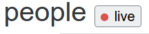

# live_people_app
Manage people with channel model bindings and vue.js

See it live!  https://live-people-app.herokuapp.com/

## Features

* 3 way model binding. All clients are in sync all the time.
* Uses Django Channels / model binding to push model changes.
* Uses `vue.js` for a lightweight interactive experience.

* Vue integration with django's templates and forms for validation and data cleaning.
* Management command that periodically resets the database and syncs & notifies connected clients of the update.
* (Technical Jargon:) Custom websocket reply channel consumer that allows individual clients to request information from the server via websocket.
* Not TOTALLY ugly. I like this live icon: 
  

## Up and Running

1. `mkvirtualenv -p python3 people`
2. `sudo bash ./utility/install_os_dependencies.sh install`           
3. `bash ./utility/install_python_dependencies.sh`  
4. `docker-compose up -d`
5. `chmod +x ./manage.py`
5. `./manage.py runserver`
